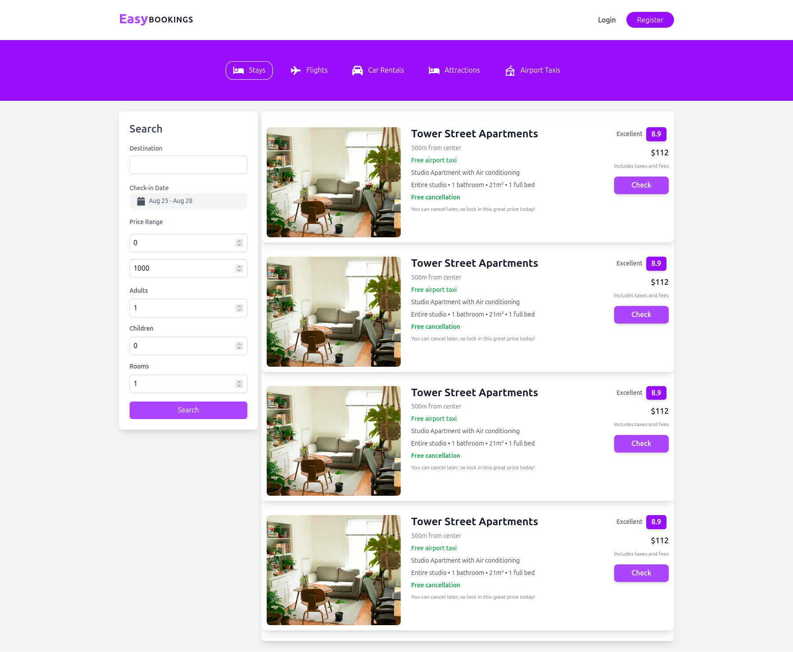

# EasyBookings

## Introduction

EasyBookings is a full stack web application designed to streamline the booking process for hotels and other accommodations. It provides a user-friendly interface for customers to search, book, and manage their reservations while offering administrators powerful tools to manage listings, availability, and bookings.

## Screenshots


<br/>

<br/>

<br/>

## Demo

Check out the live demo at [EasyBookings Demo](https://itseasybookings.vercel.app).

## Features

- **User Registration and Authentication**: Secure user accounts built with industry-standard practices.
- **Search and Filter**: Users can search for accommodations based on location, date, price range, and amenities.
- **Booking Management**: Customers can view, modify, or cancel their bookings easily.
- **Admin Dashboard**: Administrators can manage listings, view booking statistics, and handle user inquiries.
- **Responsive Design**: The application is fully responsive and works seamlessly on mobile and desktop devices.

## Technologies Used

- **Frontend**: React, Tailwind CSS
- **Backend**: Node.js, Express
- **Database**: MongoDB
- **Authentication**: JWT (JSON Web Tokens)

## Installation

1. Clone the repository:
   ```bash
   git clone https://github.com/yourusername/EasyBookings.git
   ```
2. Navigate to the project directory:
   ```bash
   cd EasyBookings
   ```
3. Install dependencies for backend:
   ```bash
   cd backend
   npm install
   ```
5. Install dependencies for frontend:
   ```bash
   cd frontend
   npm install
   ```
6. Set up environment variables:
   - Create a `.env` file in both the frontend and backend root directories and add your configuration variables.

7. Start the application:
   ```bash
   cd backend
   npm run dev
   ```
   In a separate terminal, start the frontend:
   ```bash
   cd frontend
   npm run dev
   ```

## Contributing

Contributions are welcome! Please open an issue or submit a pull request for any enhancements or bug fixes.

